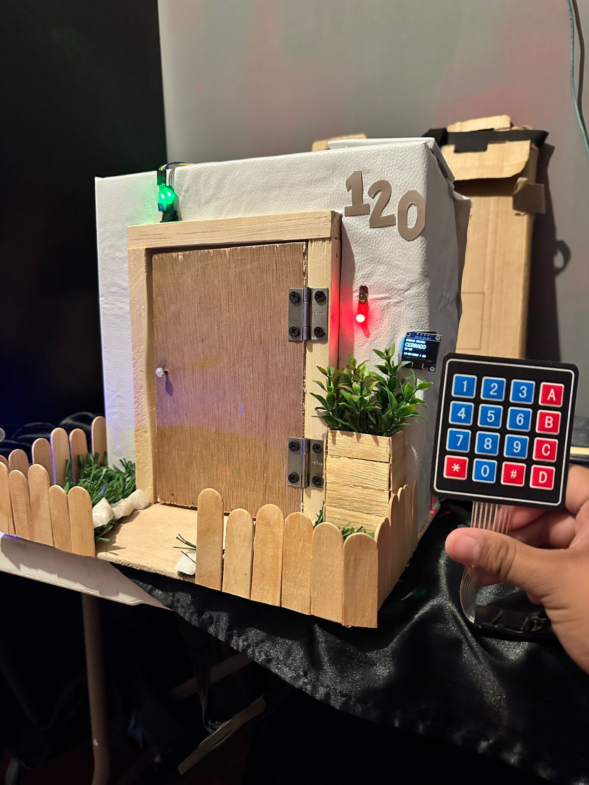
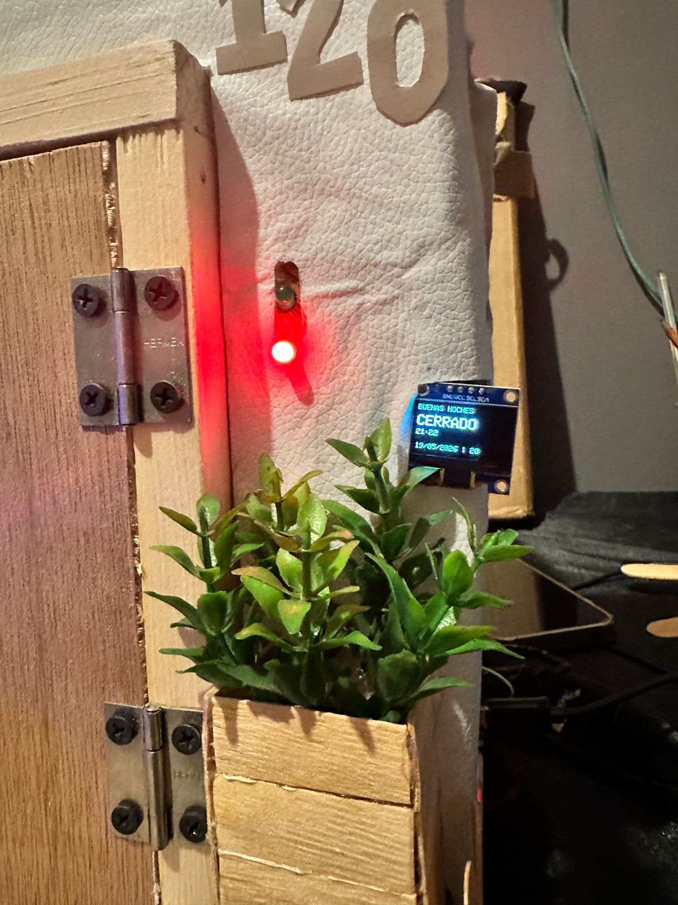

<h1 align="center">LockDoor System 🚪</h1>

<p align="center">
  <strong>Un sistema de control de acceso inteligente basado en ESP32 con Reconocimiento Facial, PIN y Administración Web.</strong>
</p>

## 📖 Descripción General

LockDoor System te permite asegurar cualquier puerta y desbloquearla mediante múltiples métodos:
- **Reconocimiento Facial**: Escanea tu rostro usando una webcam.
- **PIN por Teclado Matricial**: Ingresa tu código secreto directamente en la puerta.
- **Apertura Remota (Web)**: Abre la puerta desde cualquier lugar a través de la interfaz web (Admin Panel).
- **Botón Físico**: Para abrir la puerta fácilmente desde adentro.

El cerebro del hardware es un **ESP32** que se conecta a una red local y se comunica con una API en Python (FastAPI) y una base de datos MySQL, todo gestionado desde una bonita interfaz web en React.

---

## 🏗️ Arquitectura y Tecnologías

El sistema se compone de cuatro capas principales que se comunican por HTTP/REST:

1. **Hardware (Firmware)**: ESP32 programado en C++. Controla un relé, pantalla OLED, teclado 4x4, sensor infrarrojo, LEDs y un zumbador (buzzer).
2. **Backend (API)**: Python 3 con FastAPI. Procesa imágenes de la cámara, realiza el reconocimiento facial, verifica PINs y almacena la bitácora en MySQL.
3. **Frontend (Web)**: React 19 + Vite. Interfaz de usuario para escanear el rostro y un panel de administración para registrar usuarios y ver los accesos recientes.
4. **Base de Datos**: MySQL almacena los usuarios autorizados y el historial de acceso.

---

## 🔌 Hardware y Conexiones (ESP32)

### Lista de Componentes
- 1x ESP32 DevKit V1
- 1x Módulo Relé (5V con optoacoplador)
- 1x Cerradura eléctrica de 12V DC (con su propia fuente de alimentación)
- 1x Teclado Matricial 4x4
- 1x Pantalla OLED SSD1306 (I2C)
- 1x Sensor Infrarrojo (IR) para detectar puerta abierta/cerrada
- 1x Buzzer Activo (5V)
- 2x LEDs (1 Verde, 1 Rojo) con sus resistencias de 220Ω o 330Ω
- 1x Botón Pulsador

### Tabla de Conexiones (Pinout)

| Componente | Pin ESP32 | Notas |
| :--- | :--- | :--- |
| **Relé (Cerradura)** | GPIO 4 | LOW = bloqueado, HIGH = desbloqueado |
| **Botón físico** | GPIO 14 | INPUT_PULLUP, activo en LOW |
| **LED Verde** | GPIO 2 | Indica puerta desbloqueada |
| **LED Rojo** | GPIO 13 | Indica puerta bloqueada |
| **Buzzer Activo** | GPIO 15 | Lógica invertida: LOW = suena |
| **Sensor IR** | GPIO 27 | Detecta si la puerta está abierta/cerrada |
| **Teclado Filas 1-4** | GPIO 32, 33, 25, 26 | Filas del teclado 4x4 |
| **Teclado Columnas 1-4** | GPIO 23, 19, 18, 5 | Columnas del teclado 4x4 |
| **OLED SDA** | GPIO 21 | Bus I²C |
| **OLED SCL** | GPIO 22 | Bus I²C |

> [!CAUTION]
> **Precauciones Importantes**
> * NUNCA alimentes la cerradura eléctrica de 12V directamente desde el ESP32. Utiliza una fuente externa controlada por el relé.
> * Conecta un diodo rectificador (ej. 1N4007) en paralelo con la cerradura eléctrica (polarización inversa) para proteger el relé de los picos de voltaje inducidos (flyback).
> * Alimenta el ESP32 por USB o por el pin VIN con 5V, y verifica que el OLED utilice los 3.3V del ESP32.

---

## 🚀 Instalación y Despliegue

Sigue estos pasos para construir y ejecutar el proyecto en tu máquina local.

### Paso 2: Configuración del Entorno (Automática)

> [!WARNING]
> **Usuarios de Windows:** Antes de ejecutar el script, debes instalar [Visual Studio C++ Build Tools](https://visualstudio.microsoft.com/es/visual-cpp-build-tools/) (marcá la opción "Desarrollo para el escritorio con C++"). Esto es obligatorio para que el sistema pueda compilar la IA de reconocimiento facial.

Para facilitar la configuración, el repositorio incluye scripts automáticos.

**En Windows**: Ejecuta el archivo `setup.bat` dando doble clic.
> - **En Linux/Mac**: Ejecuta `chmod +x setup.sh` y luego `./setup.sh`.
> 
> *Estos scripts crearán el entorno virtual de Python, instalarán las dependencias del backend y también instalarán los paquetes de Node.js para el frontend. Solo tendrás que hacer los pasos de base de datos y ESP32 manualmente.*

### 1. Preparar la Base de Datos (MySQL)
Necesitas tener MySQL Server instalado.
1. Abre tu terminal de MySQL (`mysql -u root -p`).
2. Ejecuta el archivo de inicialización incluido:
   ```bash
   source database/init.sql;
   ```
   *Esto creará la base de datos `lockdoor_db` y las tablas `users` y `access_logs`.*
3. Edita la contraseña de la base de datos en el archivo `face-api/main.py` (`YOUR_MYSQL_PASSWORD`) para que coincida con tu entorno local.

### 2. Flashear el ESP32
1. Abre `smart_lock/smart_lock.ino` en el Arduino IDE.
2. Asegúrate de instalar las librerías necesarias desde el Library Manager:
   - `Adafruit SSD1306`
   - `Adafruit GFX Library`
   - `Keypad` (by Mark Stanley, Alexander Brevig)
3. En el código, reemplaza los valores de configuración con los de tu red y computadora:
   ```cpp
   const char* ssid = "YOUR_WIFI_SSID";
   const char* password = "YOUR_WIFI_PASSWORD";
   const String pythonServerIP = "http://YOUR_PYTHON_SERVER_IP:8000"; // La IP local de tu PC ejecutando la API Python
   ```
4. Conecta el ESP32, selecciona el puerto COM y súbelo a la placa.
5. El ESP32 mostrará su dirección IP asignada en la pantalla OLED. Toma nota de ella.

### 3. Ejecutar la API de Reconocimiento Facial (Python)
1. Abre el archivo `face-api/main.py` y edita la variable `ESP32_IP` con la dirección IP que te mostró la pantalla OLED del ESP32 en el paso anterior.
   ```python
   ESP32_IP = "http://YOUR_ESP32_IP" # Ejemplo: "http://192.168.1.100"
   ```
2. Instala las dependencias y corre el servidor (se recomienda usar un entorno virtual):
   ```bash
   cd face-api
   python -m venv venv
   # En Windows:
   venv\Scripts\activate
   # En Mac/Linux:
   # source venv/bin/activate
   
   pip install fastapi uvicorn face_recognition opencv-python numpy mysql-connector-python requests
   
   uvicorn main:app --host 0.0.0.0 --port 8000 --reload
   ```
   > [!NOTE]
   > La librería `face_recognition` requiere `CMake` y las Visual Studio Build Tools con C++ en Windows. En Linux/Mac suele ser más sencilla de instalar.

### 4. Ejecutar el Panel Web (React)
Abre otra terminal para arrancar el frontend:
```bash
cd face-recognition-door
npm install
npm run dev
```
La aplicación estará disponible en `http://localhost:5173`. Asegúrate de que el servidor FastAPI de Python (puerto 8000) esté corriendo ANTES de usar el frontend.

---

## 🕹️ Uso del Sistema

* **Escanear Rostro:** Entra a la página web, ve a la sección "Door Scanner" y presiona "Scan Face". El backend validará la imagen y enviará una señal de desbloqueo al ESP32 si te reconoce.
* **Registrar un nuevo Rostro/PIN:** Entra a la pestaña "Admin Panel" (la contraseña por defecto en el frontend es *admin123*, revisa el código fuente de React si deseas cambiarla), registra un usuario con la cámara y un PIN opcional de 4 dígitos.
* **Uso del Teclado Local (ESP32):**
  * Digita un número y presiona `#` para validarlo con el backend.
  * Presiona `*` para borrar lo escrito.
  * Presiona `A` para cambiar el PIN local de emergencia (te pedirá el PIN actual).
* **Bloqueo Automático:** Tras 5 segundos de ser abierta, la cerradura vuelve a bloquearse automáticamente y las luces LED rojas se encienden.

---

## 📸 Galería del Sistema

<div align="center">
  
  
</div>

---

## 📹 Video de Demostración
Puedes ver un video del sistema en funcionamiento aquí:
[Ver Funcionamiento del LockDoor System](https://drive.google.com/file/d/1c9ymSRzL5OwOYsbKE-TpPTTmx2G9IWRE/view?usp=drive_link)
